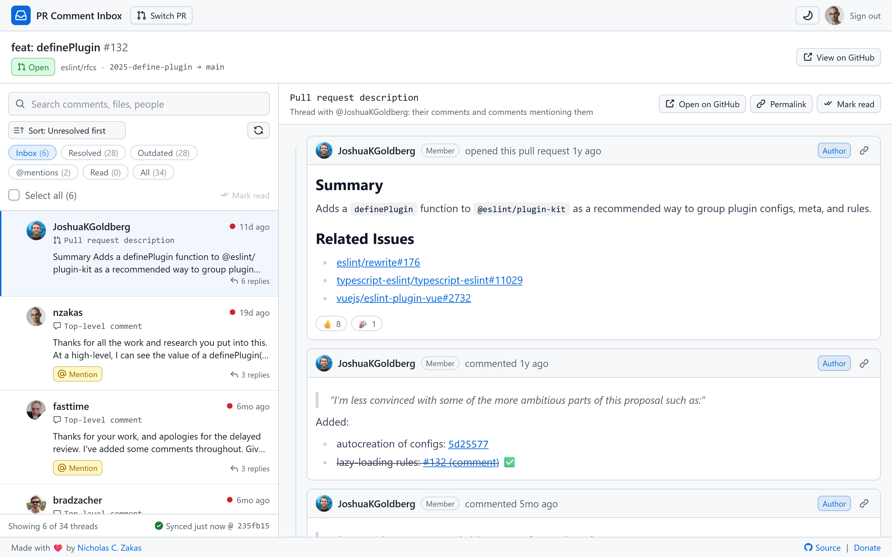

For the past couple of years, I've complained about GitHub's pull request interface. It seems designed primarily for small changes with only a few comments. Large pull requests with many comments still load slowly and are nearly impossible to manage in the web interface. Although comments on diffs are organized into threads, there's no easy way to track replies to top-level comments. On top of that, GitHub hides comments and threads in the Conversations tab once a pull request has enough comments, making conversations even harder to follow.

The pull request interface focuses so heavily on reviewers that authors get a worse experience. If you've never had to triage 100 comments on a pull request you've submitted, consider yourself lucky. It's frustrating and exhausting.

After yet another pull request of mine quickly gathered 90 comments, I decided I needed to do something about it.

## Enter PR Comment Inbox

In several discussions with people at GitHub, I mentioned that I wanted an Outlook-style way to review and organize pull request comments. I really want discussion-style inline threads, but being able to see the start of every conversation on a pull request and triage them systematically would relieve a lot of my pain. Unfortunately, those discussions didn't go anywhere. I was about to contact my GitHub connections again when I had a thought: What if I used AI to build what I wanted?

So here it is, the boringly-named PR Comment Inbox[^1].

The key feature is the left pane that contains a list of what I call "conversation starters," which are:

1. Any inline comments
2. Any top-level comments that don't begin with a `@`
3. The pull request description itself

When you click on any item in the left pane, the thread and surrounding context appear in the right pane. From there, you can reply, apply suggestions, and resolve the threads.

The trickier part was coming up with a threading algorithm for everything else.

## Synthetic threads for comments

My approach to creating top-level comment threads is largely based on `@` mentions. When someone comments on a PR for the first time, they typically don't start with an `@` mention, so that comment becomes an entry in the left pane. Any other comment from that user that doesn't begin with an `@` mention goes into the same thread, so you can see all of that user's top-level comments in the right pane.

When a comment starts with `@`, it's nested under the most recent preceding comment from the user it mentions. I chose this simple heuristic rather than checking every `@` mention in a comment and trying to merge conversations between multiple people. I've found that keeping threads limited to a small number of people makes them easier to follow, even if I have to jump between a handful of related threads.

The pull request description acts like the first comment on the pull request, so other top-level comments from the author and comments that mention the author with `@` appear in that thread.

## Marking threads as read

The next problem was figuring out how to track the threads I'd already triaged and replied to. The GitHub API doesn't provide a way to do that, so I came up with a simple read/unread model for both top-level and inline comments. (Important: "read" is not the same as "resolved" for inline comments. They're separate states.)

Marking a thread as read removes it from the inbox, and its state is stored in `localStorage`. You won't see it again unless you mark it as unread or someone adds a newer comment to the thread. The goal is to make the inbox work a lot like Gmail's.

## Free and open source

Because I don't believe in charging for features that should be part of existing products, PR Comment Inbox is open source and available on GitHub[^1]. I originally built it as a demo for GitHub, but after investing so much thought and effort, I decided to share it with everyone. I'm sure I'm not the only person who struggles with comment-heavy PRs.

You can also view and use a live demo[^2].

## Conclusion

I still want GitHub to implement proper threading for top-level comments in pull requests, and also to implement an interface like PR Comment Inbox in the long term. In the short-term, I hope that PR Comment Inbox helps everyone who deals with high-traffic PRs. I made it part of my regular routine in the last week and I was happy with how much more productive I was at properly responding to every comment on some busy PRs. If you've ever had to work through a comment-heavy PR, I hope it makes that experience a little less exhausting.

[^1]: [PR Comment Inbox](https://github.com/humanwhocodes/pr-comment-inbox)
[^2]: [PR Comment Inbox Live Demo](https://pr-comment-inbox.humanwhocodes.com)
